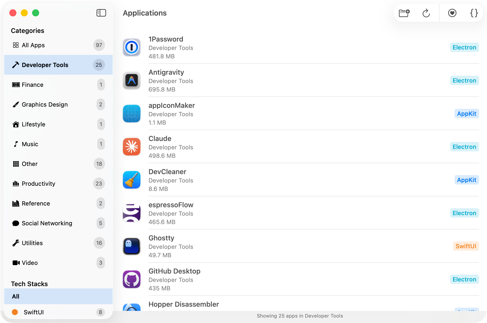

# App Detective

App Detective is a macOS application that analyzes and identifies the UI tech stacks used by macOS applications. It helps developers and users understand the frameworks and technologies behind their installed applications.

## Supported Technology Stacks

App Detective can detect the following technology stacks:

### Native Apple Frameworks
- SwiftUI
- AppKit
- Catalyst

### Cross-Platform Frameworks
- Electron
- Chromium Embedded Framework
- Python
- Qt
- Java
- Xamarin/MAUI
- Flutter
- React Native
- Tauri / GPUI / Iced
- GTK
- wxWidgets

## How It Works

The core detection logic is in the `DetectService.swift` file.

## License

MIT
