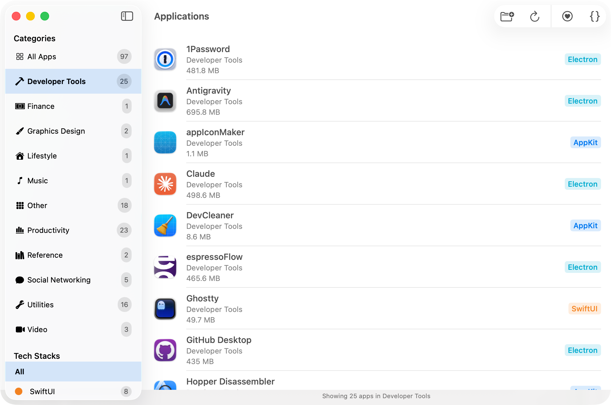

# App Detective

[](https://github.com/hewigovens/app-detective/actions/workflows/ci.yml)


App Detective analyzes and identifies the UI tech stacks used by macOS applications.



## Install

### Homebrew

```bash
brew tap hewigovens/tap
brew install --cask app-detective
```

## Command-line tool

App Detective ships with `appdetective`, a CLI for analyzing a single `.app` bundle.

Install it from inside the app: **App Detective → Install Command Line Tool…** symlinks `appdetective` into `~/.local/bin/`. If `~/.local/bin` isn't on your `PATH`, the install dialog tells you the line to add.

```bash
$ appdetective /Applications/Visual\ Studio\ Code.app
App:        Visual Studio Code.app
Path:       /Applications/Visual Studio Code.app
Bundle ID:  com.microsoft.VSCode
Version:    1.117.0 (1.117.0)
Size:       635.6 MB
Category:   Developer Tools
Stacks:     Electron
```

Use `--json` for machine-readable output (handy for scripts and agents):

```bash
$ appdetective --json /System/Applications/Calculator.app
{
  "build" : "225",
  "bundleId" : "com.apple.calculator",
  "category" : "Other",
  "name" : "Calculator.app",
  "path" : "/System/Applications/Calculator.app",
  "sizeBytes" : 6017365,
  "sizeHuman" : "6 MB",
  "stacks" : [ "SwiftUI" ],
  "version" : "12.0"
}
```

## Supported Technology Stacks

### Native Apple Frameworks
- SwiftUI
- AppKit
- Catalyst

### Cross-Platform Frameworks
- Electron
- Chromium Embedded Framework
- Python
- Qt
- Java
- Xamarin/MAUI
- Flutter
- React Native
- Tauri / GPUI / Iced
- GTK
- wxWidgets

## Contributing

See [CONTRIBUTING.md](CONTRIBUTING.md).

## License

BSL 1.1 — free to use, modify, and redistribute; paid app store distribution requires permission. Converts to Apache-2.0 on 2030-03-23. See [LICENSE](LICENSE).
