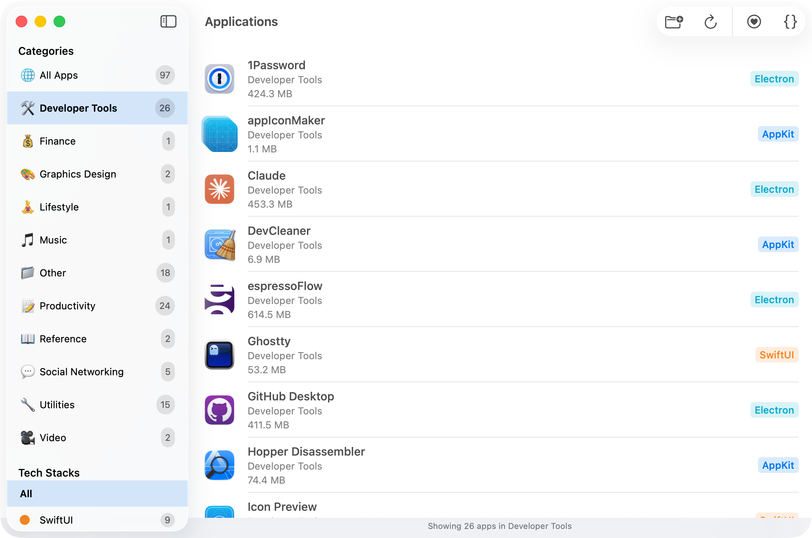

# App Detective

[](https://github.com/hewigovens/app-detective/actions/workflows/ci.yml)


App Detective is a macOS application that analyzes and identifies the UI tech stacks used by macOS applications. It helps developers and users understand the frameworks and technologies behind their installed applications.



## Installation

### Homebrew

```bash
brew tap hewigovens/tap
brew install --cask app-detective
```

## Release Workflow

- `just archive <version>` builds a Release archive via Xcode.
- `just export <version>` pulls `AppDetective.app` from the archive into `build/export`.
- `just zip <version>` creates a zip in `build/dist`.
- `just release <version>` runs the full pipeline in sequence.

## Supported Technology Stacks

App Detective can detect the following technology stacks:

### Native Apple Frameworks
- SwiftUI
- AppKit
- Catalyst

### Cross-Platform Frameworks
- Electron
- Chromium Embedded Framework
- Python
- Qt
- Java
- Xamarin/MAUI
- Flutter
- React Native
- Tauri / GPUI / Iced
- GTK
- wxWidgets

## How It Works

The core detection logic is in the `DetectService.swift` file.

## License

MIT
